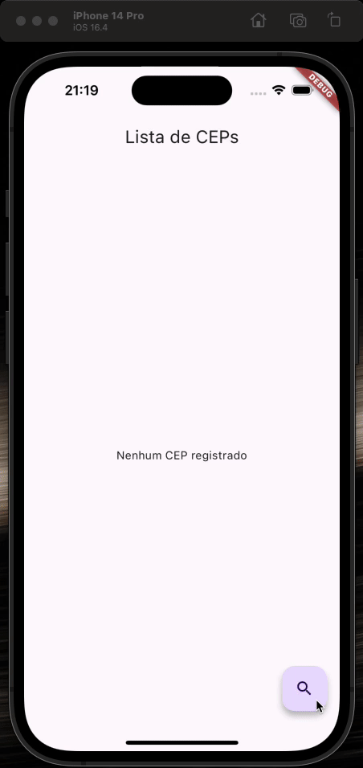

# Desafio Dio: Consumo de APIs REST com Flutter

## Projeto

Este repositório contém o código-fonte de um aplicativo Flutter para consulta de CEPs. CEPs pesquisados pela primeira vez são buscados pela API do ViaCEP e gravados em um banco de dados remoto (Back4App). Estes dados gravados podem ser posteriormente acessados pela aplicação, e também podem ser removidos.

## Pacotes Utilizados

- [equatable](https://pub.dev/packages/equatable): pacote que possibilita a correta comparação de objetos abstraindo a sobrescrita do operator `==` e do `hashCode`;
- [dio](https://pub.dev/packages/dio): pacote utilizado para as chamadas HTTP às APIs;
- [flutter_modular](https://pub.dev/packages/flutter_modular): pacote utilizado para injeções de dependências e como sistema de rotas;
- [flutter_triple](https://pub.dev/packages/flutter_triple): padrão de gerenciamento de estados proposto pela comunidade Flutterando.
